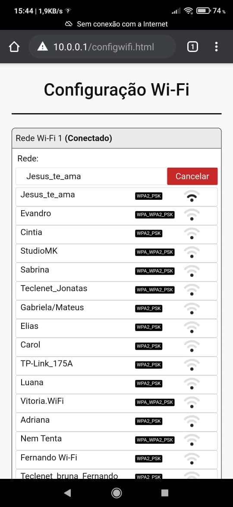

# Wifi - Manager

# Conceitos abordados no Projeto

* Controle de GPIO - Piscadas de LED.
* Timer.
* Memória NVS.
* Funções, struct, enum, mutex, tasks, event groups.
* Wifi modo AP.
* Wifi modo STA.
* Wifi modo Procura.
* Servidor Web.
* Criação e tratamento de JSONs.
* HTML, CSS e JS
* LOG

# Funcionamento

## Conexão com AP

O presente projeto, criado para o ESP8266 (Wemos D1), gera um ponto de acesso chamado
"WiFi-Manager" e a senha é "wifimanager", para acessár o Web Server, deve ser conectado no seu ponto de acesso e inserir no navegador o endereço IP 10.0.0.1, este IP foi fixado no código e não existe configuração deste parâmetro.

## WEB Server

Na página inicial existe as opções de _tempo real_, _configuração Wifi_ e _configuração do módulo_ e _Reiniciar dispositivo_

### Tempo Real

Exibe variáveis da aplicação, essa tela é apenas um exemplo basico de tela de tempo real com requisições fetch e dados do tipo JSON.

### Configurar Wi-Fi

Pode ser definido até 5 Wi-Fi para o ESP8266 usar no modo de _auto procura_. 

Pode ser difinido a conexão é com IP fixo ou dinânimo. 

Nesta tela tem o botão _Procurar_, que realiza a pesquisa de Wi-Fi e lista para seleção, exibindo o nome e potência de sinal.

Por fim, existe a senha de configuração que deve ser enviada para aplicar as alterações, essa senha pode ser configurada nas configurações do módulo e por padrão é "1234".

### Configurar Módulo

Nesta tela é possível alterar o nome do AP e mudar a senha de configuração ("1234"), a senha do AP é fixa, podendo ser implementada essa configuração futuramente.

### Reiniciar Módulo

Nos casos de desconexão de Wi-Fi, em casos de remover o Wi-Fi das configurações, ou da mudança do nome do AP, é necessário reiniciar o módulo.

## Modo STA - Auto Procura 

Ao ligar o módulo, ele inicia o serviço de procura e conexão automática, de acordo com as 5 Wi-Fi configurados. Ele escaneia os Canais 10 vezes com interva-lo de 2,5 segundos e depois aguarda 1 minuto para realizar a procura novamente. Se ele encontrar um Wi-Fi mas a senha for incorreta, ele rejeita o ponto de acesso no próximo loop de procura, para uma possivel conexão com outro ponto de acesso.

Após encontrar e conectar em um ponto de acesso, pode ser acessado o WEB Server através do IP configurado inserido no navegador, ex.: "192.168.1.245".

## NVS

Todos os parâmetros configuraveis via WEB Server são armazenados na Flash embarcada do módulo, que por ser não volátil, não são perdidas quando o módulo é desligado.

## Timer

Para a contagem de tempo correta em funções com necessidade de contagem de tempo mesmo com a tarefa inativa, foi implementado o _hw_timer_ configurado para estouro a cada 1 ms.

## LED Status

Foi criada uma biblioteca com modos de piscadas diferentes para o LED.
No código atual, foi usado apenas o modo de piscada lenta para indicar que a tarefa de aplicação está rodando em paralelo ao serviço Wi-Fi.

## Aplicação

Este serviço de configuração e conexão Wi-Fi, são serviços base e secundários na aplicação de IoT. Dispensando o uso de Botôes em GPIOs e Telas, usando um smartphone e assim deixando uma aplicação bem mais compacta.

## Front End

Para criar o Front End foi utilizado um framework chamado _mini.css_ com algumas alterações, facilitando no desenvolvimento das telas do WEB Server.
Este foi escolhido com base no seu tamanho e no que ele possui, como Grids e estilos de botões. Pode ser escolhido ou criada uma biblioteca de estilos conforme demanda do projeto, mas sempre cuidando com o espaço de memória do Chip.
Também foi adicionado o arquivo _manifest.json_ para ser possível criar um icone na tela inicial do smartphone e abrir a aplicação em tela cheia, parecido com um aplicativo.

# Conclusão

Este projeto comprova a necessidade de engenheiros da computação na área de IoT
e sistemas embarcados pois é um trabalho que uniu muitas das linguagens e conceito de comunicação de dados usados pelo engenheiro da computação alinhado a área de hardware.

Como Sugestão, fica a criação de um aplicativo mobile com framework multiplataforma, liberando a necessidade de lógicas de tela e ocupação de memória por arquivos estáticos, mantendo apenas as rotas de configurações.
Porém, se a aplicação é pequena, pode ser usado este projeto como base para desenvolvimentos futuros.

## Autores

* Jonas P. Geremias
* Filipi Piucco

# Imagens da Aplicação

